#  Spatial Transformer Network TE算子开发指导

**本文介绍了如何用TE开发出[Spatial Transformer Network](https://arxiv.org/abs/1506.02025)的全过程与相关源代码的解析。**以下将Saptial Transformer Network简称为**STN**。

本文的目录结构如下：

[TOC]

## 1 TE 与TVM简介

[TE](https://www.huawei.com/minisite/ascend/cn/filedetail_20.html)（Tensor Engine）是基于[TVM](https://tvm.ai/about)（Tensor Virtual Machine）的自定义算子开发框架。

TVM是[Github的开源项目](https://github.com/dmlc/tvm)，旨在将各算子的生成规则进一步抽象，将算子本身分成各个操作原语，在需要的时候加以组合。TVM会根据算子的计算过程的定义，使用Schedule技术和Codegen技术，生成对指定硬件的算子。TVM的相关问题可参考[TVM Tutorials](https://docs.tvm.ai/tutorials/tensor_expr_get_started.html)与[TVM论坛](https://discuss.tvm.ai/)。

TE是对TVM的再次封装，TE中的函数包括两大类：[TVM原语](https://docs.tvm.ai/api/python/tvm.html)与[TE-DSL](https://www.huawei.com/minisite/ascend/cn/filedetail_20.html)。TVM原语默认运行在AI CPU上，TE-DSL 默认运行在AI CORE上。TE-DSL 封装的接口较少，实现的功能也较少，对于具有复杂逻辑的算子优先使用TVM原语。本文的STN算子采用TVM原语开发。

## 2 STN的TE算子开发流程

**本文做的工作是使用TE开发出Tensorflow下的[STN](https://github.com/tensorflow/models/tree/master/research/transformer)。**本文默认读者已熟悉STN的基本原理，对此不再赘述。如果读者对TE算子开发的基本流程还不熟悉，可先阅读《TE 自定义算子开发指导》。

### 2.1 文件说明

本文所在目录有以下文件：

```bash
.
├── data
│   ├── data_gen.py
│   └── spatial_transformer.py
├── images
├── omg_verify
│   ├── caffe.proto
│   ├── custom_STN.prototxt
│   └── custom_STN.caffemodel
├── operator
│   └── SpatialTransformer.py
├── plugin
│   └── SpatialTransformer_parser.cpp
└── README.md
```

其中，README.md为本文档。

images为本文档的图片。

data目录下，[spatial_transformer.py](https://github.com/tensorflow/models/blob/master/research/transformer/spatial_transformer.py)是Tensorflow Github中的STN实现，它需要自行下载放置在该目录下。

**本文开发的TE STN对标的是Tensorflow的spatial_transformer.py。**

operator目录下，SpatialTransformer.py为TE算子代码。

plugin目录下，SpatialTransformer_parser.cpp为TE算子插件代码。TE算子与TE算子插件是核心部分，它们的解析见第3、4节。

data目录下，data_gen.py里import了spatial_transformer.py，用于产生SpatialTransformer.py的需要的输入数据与期望输出数据，从而验证SpatialTransformer.py的正确性。

Mind Studio在创建TE算子工程时，需上传omg_verify目录下的custom_STN.prototxt与caffe.proto。这两个文件的解析见第2.2.1节。

Mind Studio在进行OMG模型转换时，需上传omg_verify目录下的custom_STN.prototxt与custom_STN.caffemodel。

下面详细介绍整体的操作流程。

### 2.2 操作流程

#### 2.2.1 创建工程

本小节介绍如何创建TE算子工程。选择Tensor Engine Project，这里工程名取为SpatialTransformer_TE，界面如下：

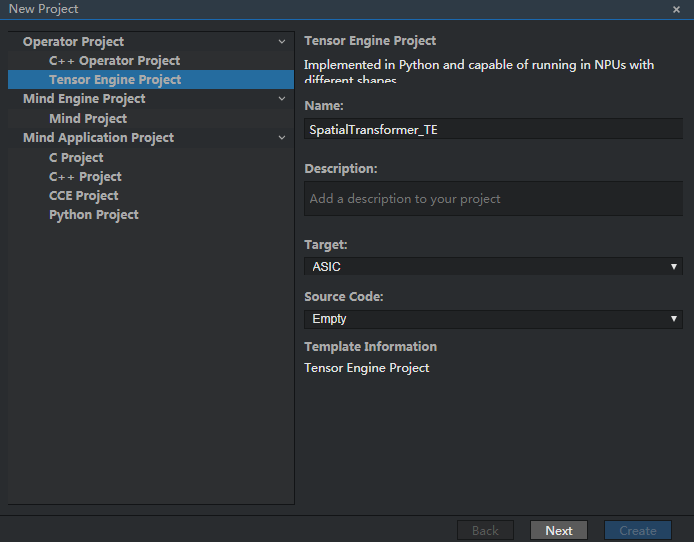

然后点击Next，上传custom_STN.prototxt，得出如下示例图。然后勾选SpatialTransformer，点击Create创建TE算子工程。

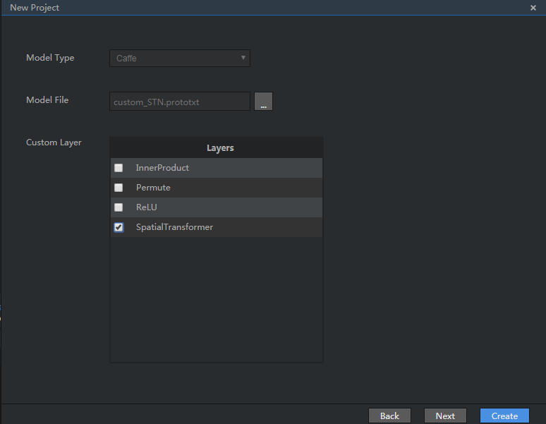

custom_STN.prototxt 是包括SpatialTransformer层的一个网络，其结构见下：

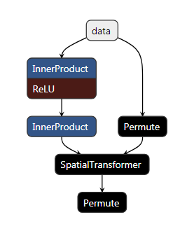

其中的SpatialTransformer层是本文用TE开发的部分。它的前后有两个Permute层，第一个Permute层作用是将数据由NCHW格式转换为NHWC格式，第二个Permute层作用是将数据由NHWC格式转换为NCHW格式。采用Permute层的原因是，Caffe里默认数据格式是NCHW，而Tensorflow则是NHWC。而本文开发的TE算子对标的是Tensorflow STN，所以数据格式也是NHWC（客户给的需求文件里也是这个格式），所以在custom_STN.prototxt中需要在它的前后增加Permute层。

如果是第一次上传custom_STN.prototxt ，那么系统内置的caffe.proto会无法解析SpatialTransformer这一层，会出现如下界面：

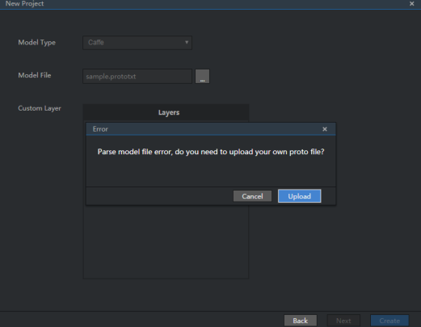

这是因为系统内置的caffe.proto没有对SpatialTransformer的描述。此时需上传本文档目录中的caffe.proto，系统会把所需字段添加到内置的caffe.proto中。

在本文档目录下的caffe.proto中，增加了两个新字段。

第一个在LayerParameter中添加类型为SpatialTransformerParameter的st_param，并赋值唯一ID：

```protobuf
message LayerParameter {
 optional string name = 1; // the layer name
 optional string type = 2; // the layer type
 repeated string bottom = 3; // the name of each bottom blob
 repeated string top = 4; // the name of each top blob
 // The train / test phase for computation.
 optional Phase phase = 10;
...
 optional SpatialTransformerParameter st_param = 367;//添加部分
...
}
```

第二个是添加SpatialTransformerParameter message：

```protobuf
message SpatialTransformerParameter {		
	// If not set,stay same with the input dimension H and W
	optional int32 output_H = 3;
	optional int32 output_W = 4;	
}
```

另外一种方法是，直接在系统内置的caffe.proto（存储路径为：“$HOME/tools/che/ddk/ddk/
include/inc/custom/proto/caffe/caffe.proto）添加上面两个字段。如果出现插件编译失败，且错误原因是无法识别该字段，可以采用这种方法解决。

#### 2.2.2 编译工程

本小节介绍如何编译TE算子工程。选中TE工程并右键单击，选择Edit Build Configuration：

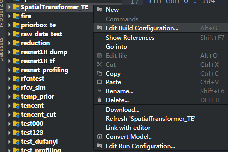

单击Build编译工程：

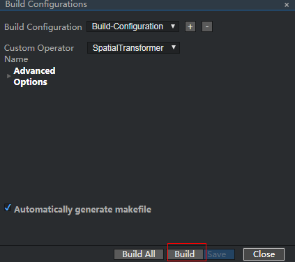

#### 2.2.3 单算子验证

本小节验证算子SpatialTransformer.py的正确性。

首先将本文档目录中的data_gen.py和spatial_transformer.py上传至TE工程的目录下，并且在命令行中输入python data_gen.py执行该文件。完成后会生成六个文件：

```bash
├── output.data
├── output.txt
├── theta.data
├── theta.txt
├── U.data
└── U.txt
```

其中.data为二进制文件，.txt为对应的文本文件。theta和U是算子的两个输入，分别代表仿射变换的参数和某一层feature map，ouput是算子的期望输出数据。下面通过比较算子本身的输出数据与期望输出数据来验证算子的正确性。

data_gen.py执行完成后，回到Mind Studio选中TE工程并右键单击，选择Edit Run Configuration：

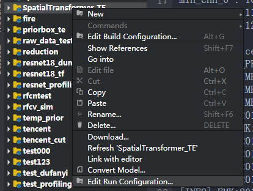

在弹出对话框的Target标签下，填入Host服务器的IP地址：

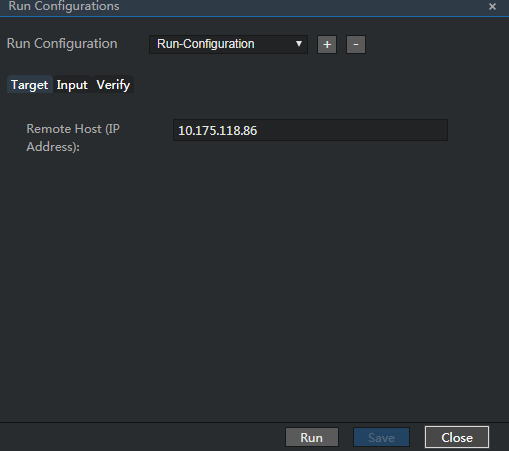

在Input标签下，给出算子的两个二进制输入数据文件与输出数据文件，并且要给出输出数据的名称，类型（此处为float32)和字节数（此处为batch_size×out_height×out_width×out_channel×Bytes(float32) = 3×6×8×3×4 = 1728）：

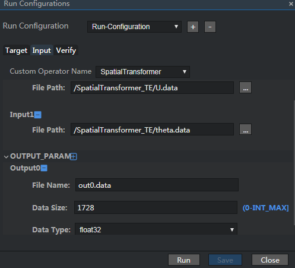

在Verify标签下，给出算子的期望输出数据文件：


compare result true 表示算子输出和期望输出一致，从而验证了单算子的正确性：

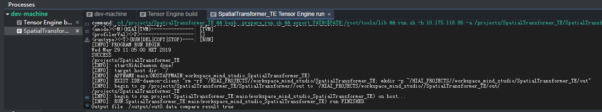

#### 2.2.4 OMG模型转换

本小节介绍将caffe模型(.prototext与.caffemodel)转换为D芯片能识别的.om模型。

选中TE工程并右键单击，选择Convert Model：

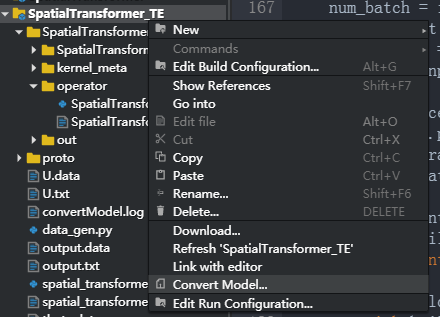

在Convert Model界面的Model File选择本文的caffe目录下的custom_STN.prototxt，其内容已在第2.2.1节给出。

Weight File选择本文caffe目录下的custom_STN.caffemodel，它是在在caffe框架下推断custom_STN.prototxt网络得出的权重。

Operator Plugin Path选择SpatialTransformer_TE工程路径。

由于这里只是为了验证开发的TE算子SpatialTransformer能够成功进行OMG模型转换，故Input Image Preprocess既可以选择On，也可以选择Off。

完成后点击OK。注意Model name不能与已有的模型名重复。

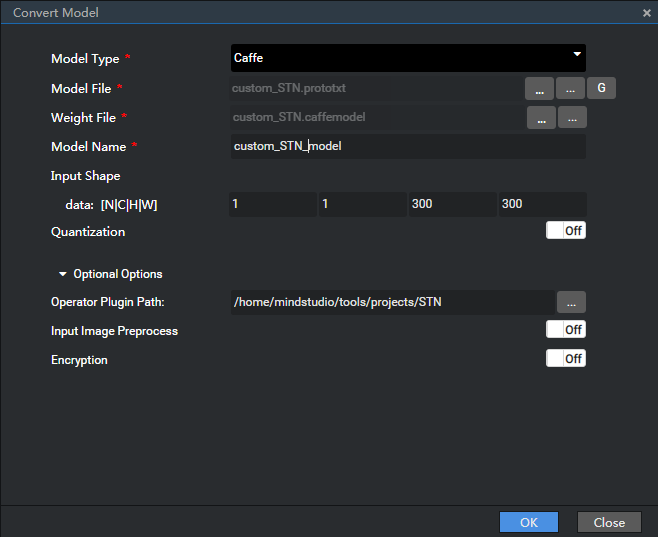

OMG模型转换成功：

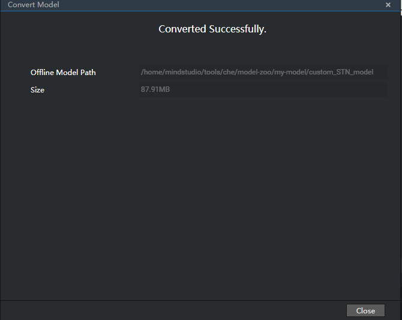

之后可在ModelZoo中找到生成的.om模型（如果没有，刷新Mind Stuido网页页面）。

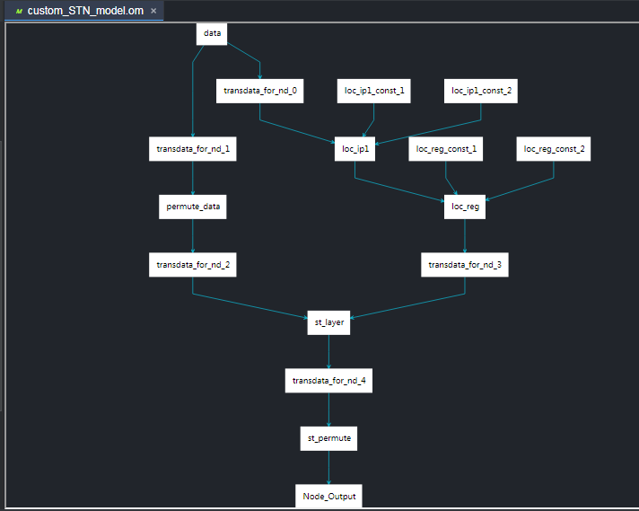

## 3 STN的TE算子代码解析

本节解析TE算子文件SpatialTransformer.py。

本文的TE STN对标的是Tensorflow Github中的spatial_transformer.py，因此TE算子文件SpatialTransformer.py的基本逻辑与spatial_transformer.py相同，将spatial_transformer.py中的使用的Tensorflow API转换为对应TE中的TVM [TOPI](https://docs.tvm.ai/api/python/topi.html) API。应当注意，TE中不包括全部开源社区的TVM TOPI API，即有的接口在开源社区的TVM TOPI中存在，但在TE 的TVM TOPI中不存在。当不存在对应API时，需要自行实现。下面介绍TE算子中自行实现的部分。

（1） _meshgrid(height, width) 函数

Tensorflow的spatial_transformer.py的_meshgrid实现为：

```python
def _meshgrid(height, width):
	with tf.variable_scope('_meshgrid'):
		tf.transpose(tf.expand_dims(tf.linspace(-1.0, 1.0, width), 1), [1, 0]))
		y_t = tf.matmul(tf.expand_dims(tf.linspace(-1.0, 1.0, height), 1),
		tf.ones(shape=tf.stack([1, width])))
        
        x_t_flat = tf.reshape(x_t, (1, -1))
        y_t_flat = tf.reshape(y_t, (1, -1))
        ones = tf.ones_like(x_t_flat)
        
        grid = tf.concat([x_t_flat, y_t_flat, ones], 0)
        return grid
```

它的入参是输出tensor的高度height与宽度width，返回坐标集合grid。例如当入参height为3，width为2时，返回的grid为：

```python
array([[-1.,  1., -1.,  1., -1.,  1.],
       [-1., -1.,  0.,  0.,  1.,  1.],
       [ 1.,  1.,  1.,  1.,  1.,  1.]], dtype=float32)
```

grid中的坐标都归一化为[ -1, 1]范围内。grid的第一行是横坐标x，有-1和1两种取值，对应width为2。第二行是纵坐标y，有-1,0和1三种取值，对应height为3。第三行固定为1。即grid的坐标信息是(-1, -1, 1)、(1, -1, 1)、(-1, 0, 1)、(1, 0, 1)、(-1, 1, 1)、(1, 1, 1)。它是下图[STN论文](<https://arxiv.org/pdf/1506.02025.pdf>)中的红色框部分：

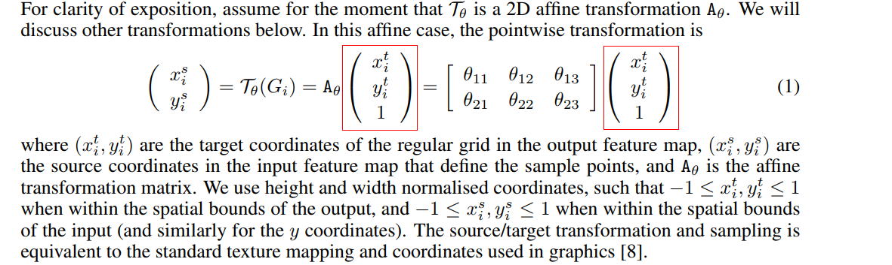

由于TE中的TVM TOPI中没有Tensorflow中的tf.matmul、tf.linspace与tf.ones_like等函数，因此需要自行实现_meshgird函数。

TE的SpatialTransformer.py的_meshgrid实现为：

```python
def _meshgrid(height, width):	
    y0 = tvm.compute((height,), lambda i: -1 + i * 2.0 / (height - 1))
    x0 = tvm.compute((width,), lambda i: -1 + i * 2.0 / (width - 1)) 
    
    y = tvm.compute((height * width,), lambda i: y0[i // width])
    x = tvm.compute((height * width,), lambda i: x0[i % width])
    
    y = topi.reshape(y, (1, height * width))
    x = topi.reshape(x, (1, height * width))
    ones = tvm.compute((1, height * width), lambda i,j:1)
           
    grid = tvm.compute((3, height * width),lambda i,j: 0.5 * (i - 1) * (i - 2) * x[0,j] + i * (2 - i) * y[0,j] + 0.5 * i * (i-1) * ones[0,j])    
    #grid = topi.concatenate((x,y,ones),0) #can not use topi.concatenate    
    return grid 
```
其中x，y与ones分别是grid的第1,2,3行，最后再通过tvm.compute将三者拼接成grid返回，从而完成了与Tensorflow的spatial_transformer.py的_meshgrid相同的功能。仍以入参height为3，width为2为例，给出上面\_meshgrid函数其中所有的变量值：

```python
# TE算子SpatialTransformer.py的_meshgrid(3, 2)时的变量值
y0 = [-1.0, 0.0, 1.0]
x0 = [-1.0, 1.0]

y = [-1.0, -1.0, 0.0, 0.0, 1.0, 1.0]
x = [-1.0, 1.0, -1.0, 1.0, -1.0, 1.0]

y = [[-1.0, -1.0, 0.0, 0.0, 1.0, 1.0]]
x = [[-1.0, 1.0, -1.0, 1.0, -1.0, 1.0]]
ones = [[1.0, 1.0, 1.0, 1.0, 1.0, 1.0]]

grid = [[-1.,  1., -1.,  1., -1.,  1.],
        [-1., -1.,  0.,  0.,  1.,  1.],
        [ 1.,  1.,  1.,  1.,  1.,  1.]]
```

可见，SpatialTransformer.py与spatial_transformer.py的输出一致。

（2） tf.matmul(a, b) 函数

tf.matmul函数可以实现2维与更高维的tensor之间的相乘。当输入a，b都是三维时，其功能是batch matmul，例如：

```python
# 3-D tensor `a`
a = tf.constant(np.arange(1, 13, dtype=np.int32),
                shape=[2, 2, 3])                  => [[[ 1.  2.  3.]
                                                       [ 4.  5.  6.]],
                                                      [[ 7.  8.  9.]
                                                       [10. 11. 12.]]]

# 3-D tensor `b`
b = tf.constant(np.arange(13, 25, dtype=np.int32),
                shape=[2, 3, 2])                   => [[[13. 14.]
                                                        [15. 16.]
                                                        [17. 18.]],
                                                       [[19. 20.]
                                                        [21. 22.]
                                                        [23. 24.]]]
# 3-D tensor `c`
c = tf.matmul(a, b) => [[[ 94 100]
                         [229 244]],
                        [[508 532]
                         [697 730]]]
```

在TE的TVM TOPI中没有batch matmul的API，因此它也需要自行实现：

```python
A = tvm.placeholder((batch, M, K), name='A')
B = tvm.placeholder((batch, K, N), name='B')
k = tvm.reduce_axis((0, K), 'k')
C = tvm.compute((batch, M, N),
         lambda b, y, x: tvm.sum(A[b, y, k] * B[b, k, x], axis = k),
         name = 'C')
```

上面的代码实现了batch matmul的功能。

## 4 SpatialTransformer的TE插件代码解析

创建SpatialTransformer_TE工程后，系统会自动生成C++插件代码。但是**自动生成的插件代码并不完整**，需要补充。

插件代码分为四个部分：解析custom_STN.prototxt的SpatialTransformer层的参数并将其存入指针op_dest中，指定输出tensor描述，调用算子文件SpatialTransformer.py并构建二进制文件，算子注册。下面依次介绍。

### 4.1 算子参数解析

本部分对应插件代码中的函数Status ParseParams()。算子参数解析部分的代码如下：

```c++
Status CaffeSpatialTransformerParseParams(const Message* op_origin, ge::Operator& op_dest)
{
    const caffe::LayerParameter* layer = dynamic_cast<const caffe::LayerParameter*>(op_origin);

    // Ckeck operator parameter's validity

    if (nullptr == layer)
    {
        printf("Dynamic cast op_src to LayerParameter failed\n");
        return FAILED;
    }
    const caffe::SpatialTransformerParameter& param = layer->st_param();

    op_dest.SetAttr("output_h", ge::AttrValue::CreateFrom<ge::AttrValue::INT>(param.output_h()));
    op_dest.SetAttr("output_w", ge::AttrValue::CreateFrom<ge::AttrValue::INT>(param.output_w()));
    return SUCCESS;
}
```
函数AddOpAttr(key, value, op_dest)中key与value是输入，op_dest是输出，其功能是在op_dest指向的对象中添加key-value对的属性。应当注意，custom_STN.prototxt中的参数为output_H，但caffe解析时会将全部字母都变成小写字母，即output_h。output_W同理。

### 4.2 输出tensor描述

本部分对应插件代码中的函数GetOutputDesc()。自动生成的输出tensor描述代码只有一行，它的作用是将第1个输入op_def_->input_desc(0)（根据custom_STN.prototxt，第1个输入为permute_data）的描述（描述包括shape, data type, data format）直接赋给第一个输出：

```c++
    Status CaffeSpatialTransformerInferShapeAndType(const ge::Operator& op, vector<ge::TensorDesc>& v_output_desc)
    {
    	auto tensorDesc      = op.GetInputDesc(0);
    	auto shape = tensorDesc.GetShape();
    	
    	int64_t output_h = 0;
        ge::AttrValue output_hAttrValue;        
        if ((ge::GRAPH_SUCCESS != op.GetAttr("output_h", output_hAttrValue)) || (ge::GRAPH_SUCCESS != output_hAttrValue.GetValue<ge::AttrValue::INT>(output_h)))
        {
            printf("Get output_h failed!\n");
        }
        if(output_h == 0)
            output_h = op.GetInputDesc(0).GetShape().GetDim(1);
        
        int64_t output_w = 0;
        ge::AttrValue output_wAttrValue;        
        if ((ge::GRAPH_SUCCESS != op.GetAttr("output_w", output_wAttrValue)) || (ge::GRAPH_SUCCESS != output_wAttrValue.GetValue<ge::AttrValue::INT>(output_w)))
        {
            printf("Get output_w failed!\n");
        }
        if(output_w == 0)
            output_w = op.GetInputDesc(0).GetShape().GetDim(2);
        
        shape.SetDim(0, op.GetInputDesc(0).GetShape().GetDim(0)); // NHWC format
        shape.SetDim(1, output_h);
        shape.SetDim(2, output_w);
        shape.SetDim(3, op.GetInputDesc(0).GetShape().GetDim(3));     
        tensorDesc.SetShape(shape);
        v_output_desc.push_back(tensorDesc);
        return SUCCESS;
    }
```
以上代码的逻辑是，当custom_STN.prototxt中有output_H时，将其作为输出tensor的高度。如果没有，则将输入permute_data的高度作为输出tensor的高度。宽度同理。

### 4.3 构建算子二进制文件

本部分对应插件代码中的函数BuildTvmBinFile()。该部分代码的作用是从op_def_中读取回4.1节存入op_dest的参数，并将它们传递给算子文件SpatialTransformer.py，最后输出.so和.json文件。需要对自动生成代码做的修改为：

```c++
// Pass the parameters you just parsed from the parseParam() to the op python function
    Status CaffeSpatialTransformerBuildTeBin(const ge::Operator& op, TEBinInfo& te_bin_info)
    {
        std::string FilePath   = "";
        std::string FuncName   = "";
        std::string KernelName = "";

         // Parse input tensor descriptor
        ge::TensorDesc input_desc = op.GetInputDesc(0);
        auto shape = input_desc.GetShape();
        
        // Parse operator's parameter and attach exception catching
        int64_t output_h = 0;
        ge::AttrValue output_hAttrValue;
        if ((ge::GRAPH_SUCCESS != op.GetAttr("output_h", output_hAttrValue)) 
            || (ge::GRAPH_SUCCESS != output_hAttrValue.GetValue<ge::AttrValue::INT>(output_h)))
        {
            printf("GetOpAttr output_h  failed!\n");
        }
        if(output_h == 0)
            output_h = input_desc.GetShape().GetDim(1);
        
        int64_t output_w = 0;
        ge::AttrValue output_wAttrValue;
        if ((ge::GRAPH_SUCCESS != op.GetAttr("output_w", output_wAttrValue)) 
            || (ge::GRAPH_SUCCESS != output_wAttrValue.GetValue<ge::AttrValue::INT>(output_w)))
        {
            printf("GetOpAttr output_w  failed!\n");
        }
        if(output_w == 0)
            output_w = input_desc.GetShape().GetDim(2);

        // Parse input shape, validate if it is equal to 4
        if (input_desc.GetShape().GetDimNum() != 4)
        {
            printf("The shape size is %d, which is not 4!", (int32_t)input_desc.GetShape().GetDimNum());
            return FAILED;
        }

        FilePath   = "/home/mindstudio/tools/projects/SpatialTransformer/SpatialTransformer/operator/SpatialTransformer";
        FuncName   = "SpatialTransformer";
        KernelName = "SpatialTransformer" + std::to_string(shape.GetDim(0)) + "_" + std::to_string(shape.GetDim(1)) + "_"  
                                          + std::to_string(shape.GetDim(2)) + "_" + std::to_string(shape.GetDim(3));
        

        /* TODO: Pass the parameters to the api function */
        te::BuildTeCustomOp(te_bin_info.ddk_version, op.GetName(), FilePath, FuncName,
                "(i,i,i,i), (i,i), s, s",
                input_desc.GetShape().GetDim(0), input_desc.GetShape().GetDim(1),
                input_desc.GetShape().GetDim(2), input_desc.GetShape().GetDim(3),
                output_h, output_w,
                "float32", 
                KernelName.c_str());

        /* TODO: Set the path of the generation files */
        te_bin_info.bin_file_path = "./kernel_meta/" + KernelName + ".o";
        te_bin_info.json_file_path = "./kernel_meta/" + KernelName + ".json";

        return SUCCESS;
    }
```

### 4.4 算子注册

该部分自动生成的代码为：

```c++
REGISTER_CUSTOM_OP("SpatialTransformer")
    .FrameworkType(CAFFE)
    .OriginOpType("SpatialTransformer")
    .ParseParamsFn(CaffeSpatialTransformerParseParams)
    .InferShapeAndTypeFn(CaffeSpatialTransformerInferShapeAndType)
    .TEBinBuildFn(CaffeSpatialTransformerBuildTeBin)
    .ImplyType(ImplyType::TVM);
```
对该部分的代码不必修改。

